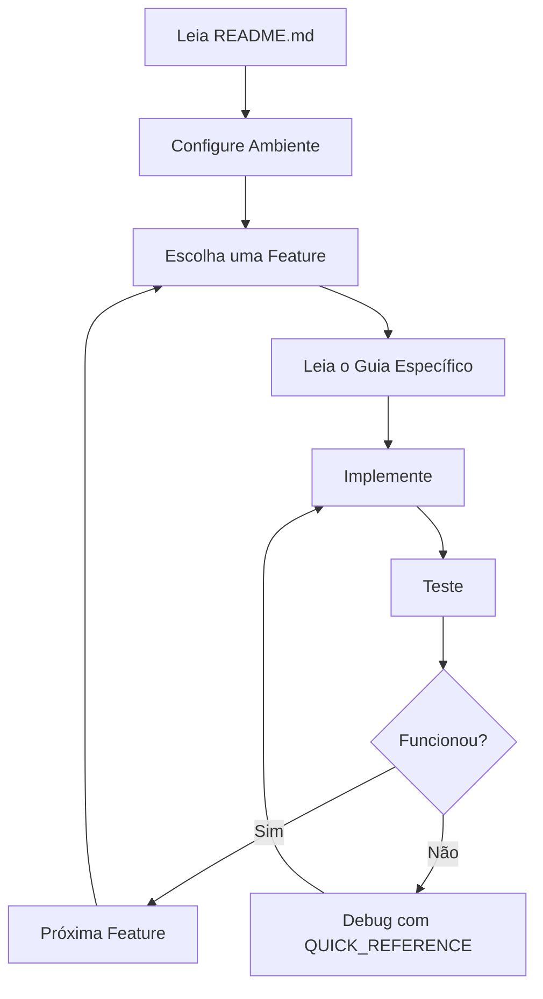

# 📚 OMINSOUNDS - Índice da Documentação

> Guia completo de navegação para toda a documentação do projeto

---

## 🎯 Por Onde Começar?

### 👨‍💻 Sou Desenvolvedor
1. ✅ Leia o [README.md](../README.md) - Visão geral do projeto
2. ✅ Configure seu ambiente: [SETUP.md](./SETUP.md)
3. ✅ Veja a [Referência Rápida](./QUICK_REFERENCE.md)
4. ✅ Escolha uma feature para implementar abaixo

### 🎤 Vou Apresentar o Projeto
1. ✅ Leia o [Script de Apresentação](./PRESENTATION.md)
2. ✅ Prepare o ambiente (backend + frontend rodando)
3. ✅ Tenha beats de exemplo cadastrados
4. ✅ Pratique o roteiro 2-3 vezes

### 🚀 Vou Implementar Features
1. ✅ Entenda a arquitetura no [README.md](../README.md)
2. ✅ Siga os guias de implementação abaixo
3. ✅ Teste cada feature antes de prosseguir
4. ✅ Use a [Referência Rápida](./QUICK_REFERENCE.md) quando precisar

---

## 📖 Documentação Completa

### 🏁 Começando

| Documento | Descrição | Tempo | Prioridade |
|-----------|-----------|-------|------------|
| [README.md](../README.md) | Visão geral, stack, estrutura | 10 min | ⭐⭐⭐ |
| [SETUP.md](./SETUP.md) | Configuração do ambiente VSCode | 30 min | ⭐⭐⭐ |
| [QUICK_REFERENCE.md](./QUICK_REFERENCE.md) | Comandos e dicas rápidas | 5 min | ⭐⭐⭐ |

---

### 🎯 Apresentação & Demo

| Documento | Descrição | Tempo | Quando Usar |
|-----------|-----------|-------|-------------|
| [PRESENTATION.md](./PRESENTATION.md) | Script completo de apresentação | 15-20 min | Pitch, demos, investidores |

**Conteúdo:**
- ✅ Roteiro passo-a-passo (15-20 min)
- ✅ Versão curta (5 min elevator pitch)
- ✅ Perguntas frequentes & respostas
- ✅ Dicas de apresentação
- ✅ Estrutura de pitch deck

---

### 💻 Implementação - Features Essenciais

#### 1️⃣ Checkout com Asaas (Alta Prioridade)

| Documento | Descrição | Complexidade | Tempo Estimado |
|-----------|-----------|--------------|----------------|
| [ASAAS_INTEGRATION.md](./ASAAS_INTEGRATION.md) | Pagamentos Pix, Boleto, Cartão | ⭐⭐⭐ | 4-6 horas |

**O que você vai construir:**
- ✅ Integração completa com Asaas
- ✅ Checkout com 3 métodos de pagamento
- ✅ Webhook para confirmação automática
- ✅ Gestão de pedidos
- ✅ Links de pagamento temporários

**Pré-requisitos:**
- Conta Asaas (sandbox)
- Backend rodando
- Entender fluxo de pedidos

---

#### 2️⃣ Página de Detalhes do Beat (Alta Prioridade)

| Documento | Descrição | Complexidade | Tempo Estimado |
|-----------|-----------|--------------|----------------|
| [BEAT_DETAILS_PAGE.md](./BEAT_DETAILS_PAGE.md) | Beat page com waveform | ⭐⭐ | 3-4 horas |

**O que você vai construir:**
- ✅ Waveform interativa (WaveSurfer.js)
- ✅ Player integrado
- ✅ Seleção de licenças
- ✅ Beats relacionados
- ✅ Compartilhamento

**Pré-requisitos:**
- WaveSurfer.js instalado
- Componente BeatCard pronto
- Beats cadastrados

---

#### 3️⃣ Sistema de Downloads (Alta Prioridade)

| Documento | Descrição | Complexidade | Tempo Estimado |
|-----------|-----------|--------------|----------------|
| [DOWNLOAD_SYSTEM.md](./DOWNLOAD_SYSTEM.md) | Downloads seguros pós-pagamento | ⭐⭐⭐ | 4-5 horas |

**O que você vai construir:**
- ✅ Links temporários (JWT)
- ✅ Limite de downloads
- ✅ Diferentes formatos por licença
- ✅ Rastreamento de downloads
- ✅ Histórico completo

**Pré-requisitos:**
- Checkout funcionando
- Webhook confirmando pagamentos
- Estrutura de uploads criada

---

#### 4️⃣ Perfil Público do Produtor (Média Prioridade)

| Documento | Descrição | Complexidade | Tempo Estimado |
|-----------|-----------|--------------|----------------|
| [PRODUCER_PROFILE.md](./PRODUCER_PROFILE.md) | Página de perfil rica | ⭐⭐ | 2-3 horas |

**O que você vai construir:**
- ✅ Hero banner customizável
- ✅ Grid de beats do produtor
- ✅ Estatísticas públicas
- ✅ Biografia e links sociais
- ✅ Botão de seguir (estrutura)

**Pré-requisitos:**
- Beats cadastrados
- Produtor com perfil
- Componente BeatCard

---

#### 5️⃣ Dashboard do Usuário (Média Prioridade)

| Documento | Descrição | Complexidade | Tempo Estimado |
|-----------|-----------|--------------|----------------|
| [USER_DASHBOARD.md](./USER_DASHBOARD.md) | Área completa do usuário | ⭐⭐ | 3-4 horas |

**O que você vai construir:**
- ✅ Dashboard com estatísticas
- ✅ Página de compras
- ✅ Página de favoritos
- ✅ Configurações de perfil
- ✅ Navegação integrada

**Pré-requisitos:**
- Autenticação funcionando
- API de pedidos pronta
- API de favoritos pronta

---

## 🗺️ Roadmap de Implementação

### Fase 1: E-commerce Completo (2-3 semanas)
```
Semana 1:
├── ✅ MVP já pronto
├── 🔨 Integração Asaas (4-6h)
└── 🔨 Sistema de Downloads (4-5h)

Semana 2:
├── 🔨 Página de Detalhes do Beat (3-4h)
├── 🔨 Perfil do Produtor (2-3h)
└── 🔨 Dashboard do Usuário (3-4h)

Semana 3:
├── 🧪 Testes end-to-end
├── 🐛 Correção de bugs
└── 📝 Documentação de APIs
```

### Fase 2: Engajamento (1-2 semanas)
```
- Sistema de avaliações
- Comentários nos beats
- Sistema de seguir produtores
- Notificações push
- Playlists personalizadas
```

### Fase 3: Monetização Avançada (2 semanas)
```
- Planos de assinatura
- Analytics avançado
- Programa de afiliados
- API pública
```

---

## 📊 Matriz de Priorização

| Feature | Impacto | Esforço | Prioridade | Status |
|---------|---------|---------|------------|--------|
| Checkout Asaas | 🔥🔥🔥 | ⭐⭐⭐ | **P0** | 📝 Documentado |
| Sistema Downloads | 🔥🔥🔥 | ⭐⭐⭐ | **P0** | 📝 Documentado |
| Detalhes do Beat | 🔥🔥 | ⭐⭐ | **P1** | 📝 Documentado |
| Perfil Produtor | 🔥🔥 | ⭐⭐ | **P1** | 📝 Documentado |
| Dashboard Usuário | 🔥🔥 | ⭐⭐ | **P1** | 📝 Documentado |
| Sistema Avaliações | 🔥 | ⭐⭐ | **P2** | ⏳ Futuro |
| Planos Assinatura | 🔥 | ⭐⭐⭐ | **P2** | ⏳ Futuro |

**Legenda:**
- 🔥 = Impacto no negócio
- ⭐ = Esforço de desenvolvimento
- **P0** = Crítico (implementar agora)
- **P1** = Importante (próximas 2 semanas)
- **P2** = Desejável (próximo mês)

---

## 🎓 Como Usar Este Guia

### Fluxo Recomendado



### Dicas de Aprendizado

1. **Não pule o SETUP.md** - Ambiente correto = menos problemas
2. **Use QUICK_REFERENCE.md** - Tenha sempre aberto
3. **Implemente em ordem** - Cada feature depende da anterior
4. **Teste incrementalmente** - Não acumule código sem testar
5. **Consulte o código atual** - Muita coisa já está pronta

---

## 🔗 Links Rápidos

### Arquivos Principais

```
Backend:
├── /app/backend/server.py       → Rotas principais
├── /app/backend/models.py       → Modelos Pydantic
├── /app/backend/auth.py         → Autenticação JWT
└── /app/backend/.env            → Configurações

Frontend:
├── /app/frontend/src/App.js     → Rotas React
├── /app/frontend/src/services/api.js  → Chamadas API
├── /app/frontend/src/store/     → Zustand stores
└── /app/frontend/.env           → Configurações

Docs:
├── /app/docs/SETUP.md           → Setup inicial
├── /app/docs/QUICK_REFERENCE.md → Referência rápida
└── /app/docs/INDEX.md           → Este arquivo
```

### Comandos Mais Usados

```bash
# Iniciar desenvolvimento
cd /app/backend && uvicorn server:app --reload
cd /app/frontend && yarn start

# Ver logs
tail -f /var/log/supervisor/backend.out.log
tail -f /var/log/supervisor/frontend.out.log

# Reiniciar serviços
sudo supervisorctl restart backend frontend

# MongoDB
mongosh
use ominsounds
db.beats.find().pretty()
```

---

## 🆘 Precisa de Ajuda?

### Problemas Comuns

| Problema | Documento | Seção |
|----------|-----------|-------|
| Projeto não inicia | [SETUP.md](./SETUP.md) | Troubleshooting |
| Comando não funciona | [QUICK_REFERENCE.md](./QUICK_REFERENCE.md) | Solução de Problemas |
| Erro de API | [QUICK_REFERENCE.md](./QUICK_REFERENCE.md) | Debug & Logs |
| Design não sai como esperado | [README.md](../README.md) | Design System |

### Checklist de Debug

```
□ Backend está rodando? (porta 8001)
□ Frontend está rodando? (porta 3000)
□ MongoDB está conectado?
□ .env configurado corretamente?
□ Dependências instaladas?
□ Logs mostram algum erro?
```

---

## 📈 Métricas de Progresso

### MVP (Completo ✅)

- ✅ Autenticação JWT
- ✅ CRUD de Beats
- ✅ Upload de arquivos
- ✅ Player global
- ✅ Carrinho
- ✅ Dashboard produtor
- ✅ Exploração com filtros

### E-commerce (Em Progresso 🔨)

- 📝 Checkout Asaas
- 📝 Downloads seguros
- 📝 Detalhes do beat
- 📝 Perfil produtor
- 📝 Dashboard usuário

### Engajamento (Planejado ⏳)

- ⏳ Avaliações
- ⏳ Comentários
- ⏳ Sistema de seguir
- ⏳ Notificações

---

## 🎯 Metas do Projeto

### Técnicas
- [ ] 100% das features P0 implementadas
- [ ] Cobertura de testes > 70%
- [ ] Performance: Lighthouse > 90
- [ ] Zero erros de console
- [ ] SEO otimizado

### Negócio
- [ ] 1.000 produtores cadastrados
- [ ] 10.000 beats disponíveis
- [ ] R$ 500k GMV em 6 meses
- [ ] Taxa de conversão > 3%
- [ ] NPS > 50

---

## 📝 Contribuindo

Ao adicionar nova documentação:

1. **Crie em** `/app/docs/`
2. **Use markdown** com emojis
3. **Adicione ao** `README.md`
4. **Atualize este** `INDEX.md`
5. **Inclua exemplos** de código
6. **Seja claro** e objetivo

---

## ✨ Sobre Esta Documentação

**Criado em**: Janeiro 2026
**Versão**: 1.0.0
**Última atualização**: Janeiro 2026
**Mantenedores**: OMINSOUNDS Team

---

**Sucesso no desenvolvimento!** 🚀🎵

*"A melhor documentação é aquela que você realmente usa."*
